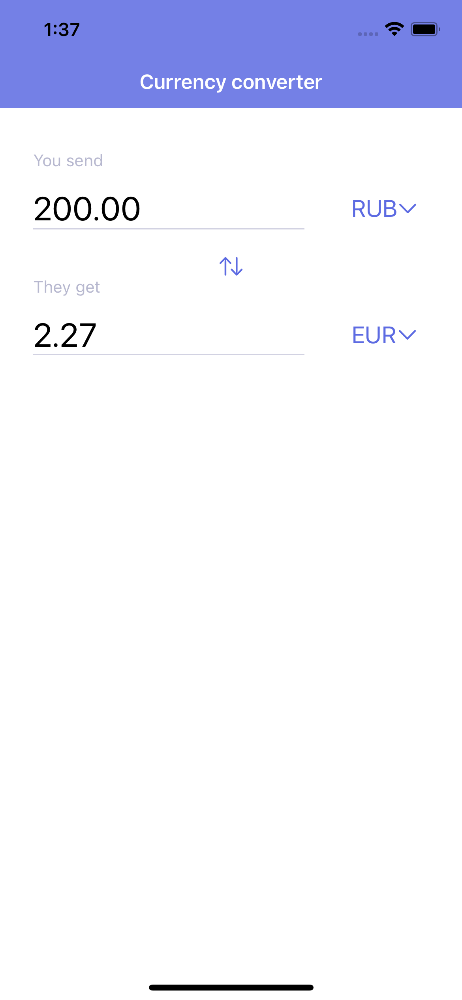
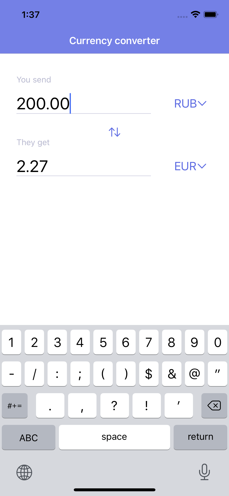
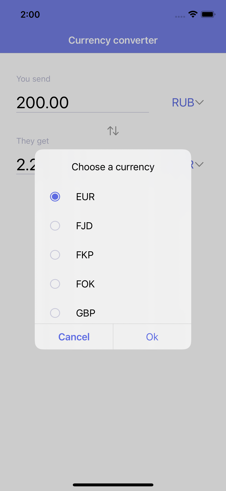

# Currency-converter

Написать приложение "Конвертер валют"

Ограничение по SDK нет, но приветствуется нативность
API: [https://open.exchangerate-api.com/v6/latest](https://open.exchangerate-api.com/v6/latest)

В приложении должно быть:
1) Выбор валют для конвертирования (из/в)

2) Интерфейс максимально схожий с прототипом

3) Сохранение данных для offline режима

    

Home

Home-typing

Choose

